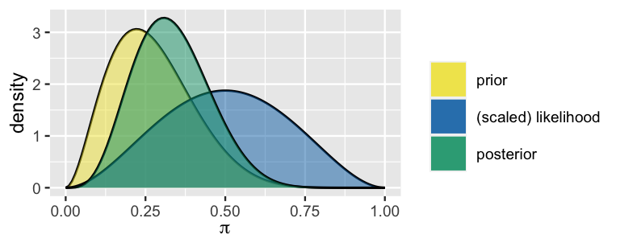

```{r}

# Load required packages
library(bayesrules)
library(tidyverse)
library(janitor)

```

## 🎬 The Bechdel Test: A Bayesian Story

::: callout-note
## Learning Objectives

By the end of this chapter, you will be able to:

-   Explore the balanced influence of the prior and data on the posterior
-   Understand how different priors lead to different posteriors
-   Perform sequential Bayesian analysis
-   Analyze how posterior models evolve with new data
:::

In Alison Bechdel's 1985 comic strip *The Rule*, a character states that they only see a movie if it satisfies three criteria:

1.  The movie has to have at least two women in it
2.  These two women talk to each other
3.  They talk about something besides a man

These criteria constitute the **Bechdel test** for the representation of women in film.

::: callout-tip
## Think About It 🤔

Before we dive into the analysis, what percentage of recent movies do you think pass the Bechdel test? Is it closer to 10%, 50%, 80%, or 100%?
:::

## 👥 Meet Our Three Analysts

Let π (a random value between 0 and 1) denote the unknown proportion of recent movies that pass the Bechdel test. Three friends have different prior beliefs about π:

-   **The Feminist** 🎭: Believes most movies lack strong women characters
    -   Beta(5, 11)
-   **The Clueless** 🤷: Unsure whether passing the test is common or uncommon
    -   Beta(1,1)\
-   **The Optimist** 😊: Thinks the Bechdel test is a low bar and most movies pass
    -   Beta(14, 1)

### 📊 Matching Priors to Beliefs

The Feminist: Use `plot_beta()` to visualize the prior

```{r}
plot_beta(5, 11)
```

The Clueless: Use `plot_beta()` to visualize the prior

```{r}
plot_beta(1,1)
```

The Optimist: Use `plot_beta()` to visualize the prior

```{r}
plot_beta(14,1)
```

::: callout-important
## Key Concepts

**Informative Prior**: Reflects specific information with high certainty (low variability) - Example: The optimist's Beta(14,1) prior

**Vague Prior**: Reflects little specific information about the unknown variable - Example: The clueless's Beta(1,1) flat prior
:::

## 🎬 The Data: Testing Our Beliefs

Let's examine a sample of movies from the FiveThirtyEight Bechdel test dataset:

```{r}

# Load the data
data(bechdel, package = "bayesrules")

# Take a sample of 20 movies
set.seed(84735)
bechdel_20 <- bechdel %>% 
  sample_n(20)

# Display first few movies
bechdel_20 
```

Calculate the pass rate

```{r}

bechdel_20 %>% 
  tabyl(binary)
```

## 🔄 From Prior to Posterior

Now let's see how each analyst updates their beliefs with this data using the Beta-Binomial model:

The Feminist: Use `plot_beta_binomial()` to visualize the posterior

```{r}
plot_beta_binomial(alpha = 5, beta = 11, y = 9, n = 20)
```

The Clueless: Use `plot_beta_binomial()` to visualize the posterior

```{r}
plot_beta_binomial(alpha = 1, beta = 1, y = 9, n = 20)
```

The Optimist: Use `plot_beta_binomial()` to visualize the posterior

```{r}
plot_beta_binomial(alpha = 14, beta = 1, y = 9, n = 20)
```

### 

::: callout-note
## Key Observation

Notice how the **clueless** analyst's posterior looks identical to the likelihood! This happens when we use a flat, uninformative prior - the data completely dominates the posterior.
:::

## 📈 The Impact of Sample Size

If you’re concerned by the fact that our three analysts have differing posterior understandings of π, the proportion of recent movies that pass the Bechdel, don’t despair yet. Don’t forget the role that *data* plays in a Bayesian analysis. To examine these dynamics, consider three new analysts – Morteza, Nadide, and Ursula – who all share the optimistic Beta(14,1) prior for π *but* each have access to different data.

Morteza reviews n=13 movies from the year 1991, among which Y=6 (about 46%) pass the Bechdel:

```{r}
bechdel %>% 
  filter(year == 1991) %>% 
  tabyl(binary) %>% 
  adorn_totals("row")
```

Nadide reviews n=63 movies from 2000, among which Y=29 (about 46%) pass the Bechdel:

```{r}
bechdel %>% 
  filter(year == 2000) %>% 
  tabyl(binary) %>% 
  adorn_totals("row")
```

Finally, Ursula reviews n=99 movies from 2013, among which Y=46 (about 46%) pass the Bechdel:

```{r}
bechdel %>% 
  filter(year == 2013) %>% 
  tabyl(binary) %>% 
  adorn_totals("row")
```

For Morteza: Use `plot_beta_binomial()` to visualize the posterior

```{r}
plot_beta_binomial(alpha = 14, beta = 1, y = 6, n = 13)
```

For Nadide: Use `plot_beta_binomial()` to visualize the posterior

```{r}
plot_beta_binomial(alpha = 14, beta = 1, y = 29, n = 63)
```

For Ursula: Use `plot_beta_binomial()` to visualize the posterior

```{r}
plot_beta_binomial(alpha = 14, beta = 1, y = 46, n = 99)
```

### 

## True & False

For each statement below, indicate whether the statement is true or false. Provide your reasoning.

1.  All prior choices are informative.

    1.  False. Vague priors are typically uninformative.

2.  There may be good reasons for having an informative prior.

    1.  True. We might have ample previous data or expertise from which to build our prior.

3.  Any prior choice can be overcome by enough data.

    1.  False. If you assign zero prior probability to a potential parameter value, no amount of data can change that!

4.  The frequentist paradigm is totally objective.

    1.  False. Subjectivity always creeps in to both frequentist and Bayesian analyses. With the Bayesian paradigm, we can at least name and quantify aspects of this subjectivity

**Exercise 4.1 (Match the prior to the description)** Five different prior models for π are listed below. Label each with one of these descriptors:

-   somewhat favoring π\<0.5,

-   strongly favoring π\<0.5,

-   centering π on 0.5,

-   somewhat favoring π\>0.5,

-   strongly favoring π\>0.5.

1.  Beta(1.8,1.8)

    1.  centering π on 0.5

2.  Beta(3,2)

    1.  somewhat favoring π\>0.5,

3.  Beta(1,10)

    1.  strongly favoring π\<0.5

4.  Beta(1,3)

    1.  somewhat favoring π\<0.5

5.  Beta(17,2)

    1.  strongly favoring π\>0.5.

**Exercise 4.2 (Match the plot to the code)** Which arguments to the `plot_beta_binomial()` function generated the plot below?

1.  `alpha = 2, beta = 2, y = 8, n = 11`

2.  `alpha = 2, beta = 2, y = 3, n = 11`

3.  `alpha = 3, beta = 8, y = 2, n = 6`

4.  `alpha = 3, beta = 8, y = 4, n = 6`

5.  `alpha = 3, beta = 8, y = 2, n = 4`

6.  `alpha = 8, beta = 3, y = 2, n = 4`



**Exercise 4.7 (What dominates the posterior?)** In each situation below you will be given a Beta prior for π and some Binomial trial data. For each scenario, identify which of the following is true: the prior has more influence on the posterior, the data has more influence on the posterior, or the posterior is an equal compromise between the data and the prior.

1.  Prior: π∼Beta(1,4), data: Y=8 successes in n=10 trials

2.  Prior: π∼Beta(20,3), data: Y=0 successes in n=1 trial

3.  Prior: π∼Beta(4,2), data: Y=1 success in n=3 trials

4.  Prior: π∼Beta(3,10), data: Y=10 successes in n=13 trials

5.  Prior: π∼Beta(20,2), data: Y=10 successes in n=200 trials
